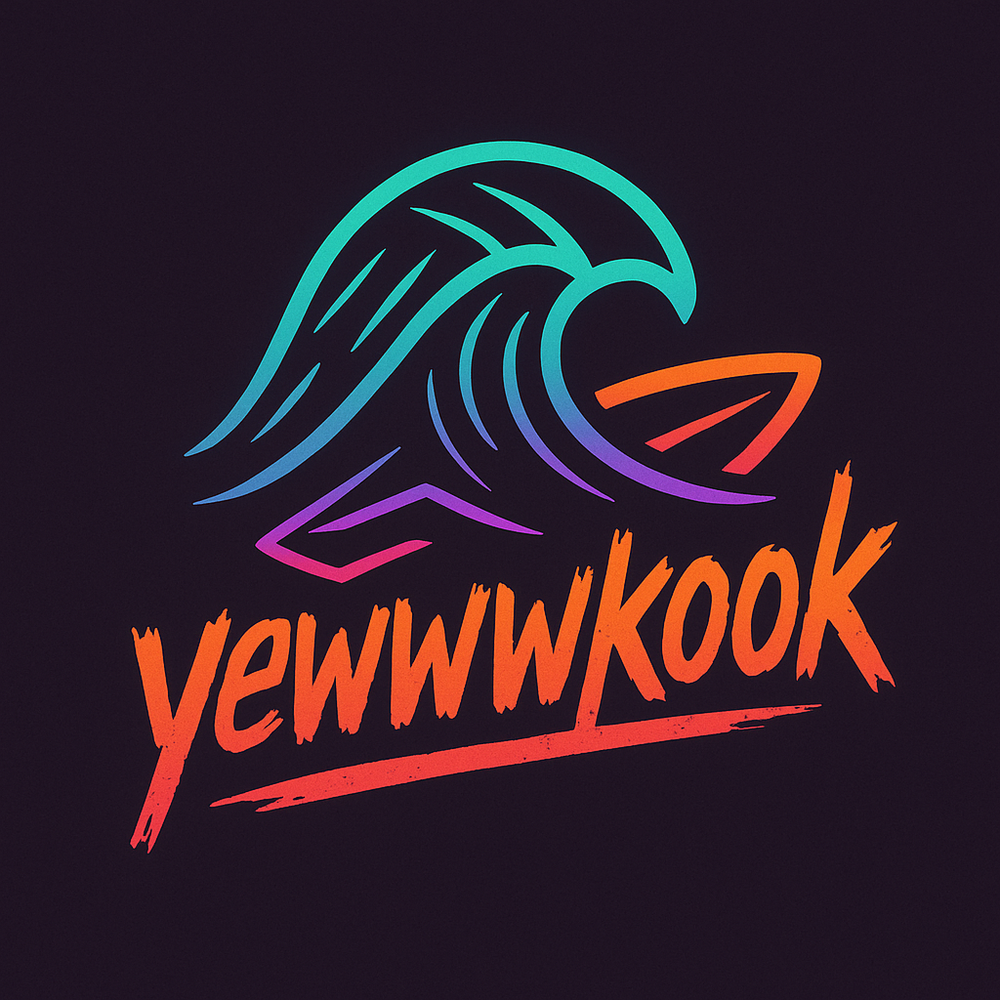

#  Yewwwkook

**Yewwwkook** is an app that delivers real-time surf reports — straight from the beach.  
No stale forecasts. No broken surf cams. Just raw, honest updates from fellow wave chasers.

---

##  Why It Exists

- Traditional surf forecasting tools are expensive or unreliable
- Surfers waste time and gas chasing poor conditions
- Cams and NOAA data are increasingly limited or broken
- The community deserves a **free, fast, and trustworthy** alternative

---

##  What It Does

Yewwwkook is a crowd-powered platform that enables surfers to share and access real-time surf conditions across their favorite breaks.

It works by rewarding verified contributors and unlocking useful insights in return,  creating a tight feedback loop driven by the surf community itself.

More details coming soon as we open our first round of live testing.

A give-to-get system that keeps the stoke alive — and the info fresh.

---

##  Core Features (Coming Soon)

- Mobile-first interface for surfers on-the-go  
- Real-time location-aware submissions  
- Community-powered insights and activity  
- Contribution-based access model  
- Clean, fast, and minimalist design focused on surf utility

More to come after internal testing and early community rollout.

---

##  Future Possibilities

We're exploring features that deepen community engagement, enhance report accuracy, and support regional surf ecosystems.

More to be revealed as the platform evolves.

---

##  Stack (General Overview)

Yewwwkook is built with a modern full-stack JavaScript stack optimized for:

- Mobile-first interaction
- Real-time content submission
- Location-based filtering
- Scalable community contribution

---

##  License

Yewwwkook is open-source under the [GNU AGPLv3 License](LICENSE).

This means you can use and modify the code freely — **but** if you run it as a public service (e.g. web or mobile app), you must also release your modified source code.

###  Commercial Use

If you're a company or organization interested in using yewwwkook **without sharing modifications**, commercial licenses are available.  
Contact: [Reach out via GitHub](https://github.com/jhladnik)

---

## 🤙 Community Guidelines

- Be respectful
- No spam or self-promotion
- Keep the vibe positive; this is built by surfers, for surfers

---

##  Project Leadership

Created and maintained by [Joe Hladnik](https://github.com/jhladnik), a full-stack developer passionate about building tools that serve real communities in real time.

---

> Coming soon — stay tuned for the full open-source drop, live data collection, and real-time surf intelligence.
